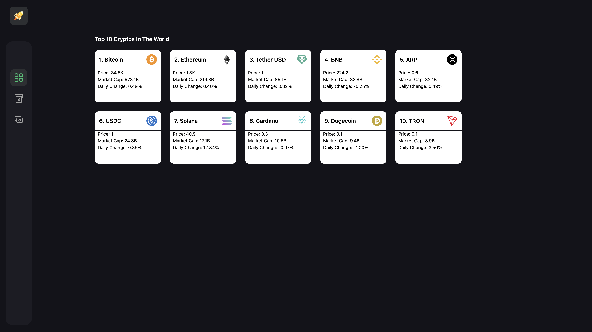
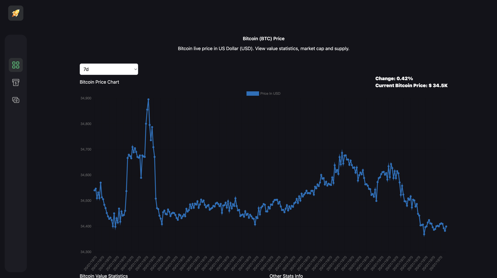
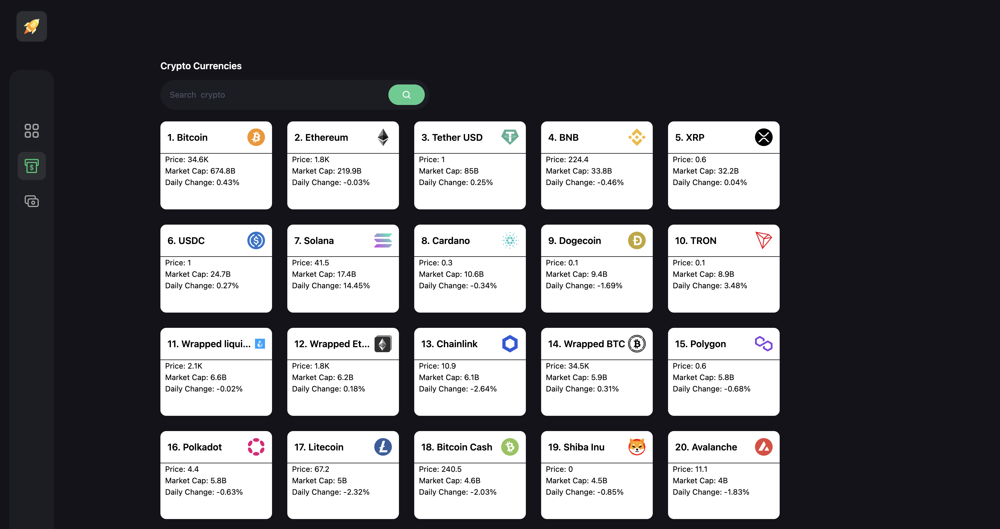
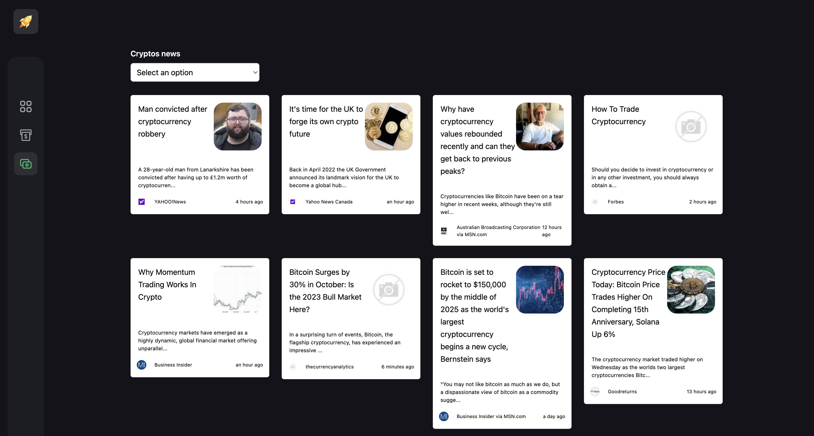

## Build React app crypto currencies with tailwindCSS and redux toolkit query
This repository is dedicated to a React application where I integrated Tailwind CSS and redux toolkit query to highlight my skills in this area. Tailwind CSS is a very powerful CSS framework that simplifies and accelerates UI development. This repository is a demonstration of my expertise in using it to create attractive and responsive interfaces. I'm happy to share my work and web development skills with the community.

 <h1 align="center">
  SAWADOGO Badini Ibrahim
</h1>

## About this Repository

## 🔐 Setup .env file
REACT_APP_RAPIDAPI_KEY 

REACT_APP_CRYPTO_API_URL 

REACT_APP_NEWS_API_URL 

REACT_APP_NEWS_RAPIDAPI_HOST 

REACT_APP_CRYPTO_RAPIDAPI_HOST 

# RapidApi
https://rapidapi.com/hub

# Technologies
- React js
- Beautiful layouts with TailwindCSS
- Create reusable components
- State management with redux toolkit
- RapidApi

  
# Screenshot

